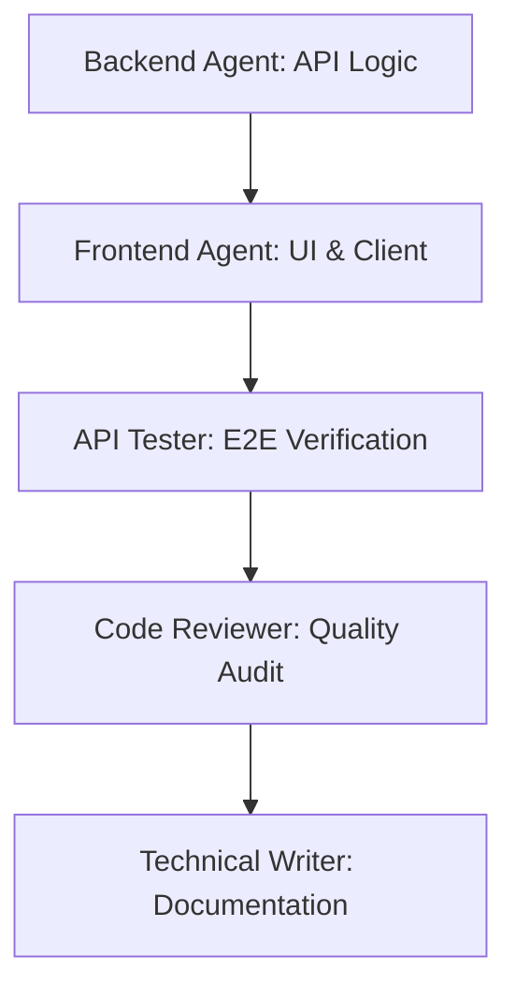

# Implementation Plan — Login Page OTP Password Reset

We will implement a password reset flow on the login page using a 6-digit One-Time Password (OTP) sent via email. 

## User Review Required

Please review the proposed design of the OTP reset flow:

> [!NOTE]
> **OTP Storage Security**
> We will generate a secure, random 6-digit OTP, SHA-256 hash it, and store it in the `password_reset_tokens` table. This reuses the existing schema without requiring a database migration.
> The raw 6-digit OTP will be sent to the user's email via Nodemailer.

> [!IMPORTANT]
> **Auth UI Modes**
> We will add two new modes to the Authentication screen:
> 1. `forgot_password`: Prompt the user for their email to request an OTP.
> 2. `reset_password_otp`: Prompt the user for the 6-digit OTP and their new password.

## Decisions (resolved)

1. **OTP expiration duration:** 15 minutes (standard for OTPs).
2. **Auth UI refactor:** `App.jsx` imports and reuses `AuthPage.jsx` directly — no duplicate `AuthPanel` implementation.
3. **Old link-based flow:** Deprecated. `/forgot-password` and `/reset-password` are replaced by `/forgot-password-otp` and `/reset-password-otp`. Documentation updated accordingly.

---

## Proposed Changes

We will execute the tasks sequentially, employing dedicated agent roles:

### 1. Backend Logic
**Assigned to:** Backend Agent
- Create `POST /api/auth/forgot-password-otp`:
  - Validate email format.
  - Query user. Generate 6-digit random OTP if found.
  - Save SHA-256 of OTP in `password_reset_tokens` (expiry: 15 minutes).
  - Send email with raw 6-digit OTP.
- Create `POST /api/auth/reset-password-otp`:
  - Validate `email`, `otp` (6 digits), and `password` (min 8 chars).
  - Find valid, unexpired, unused token matching the SHA-256 of `otp`.
  - Hash the new password using bcrypt.
  - Update user password and mark the token as used.

#### [MODIFY] [auth.js (backend routes)](file:///d:/_jeh/WebApps/E-Governance/council-system/backend/routes/auth.js)
- Implement `/forgot-password-otp` and `/reset-password-otp` endpoints.

---

### 2. Frontend client & components
**Assigned to:** Frontend Developer
- Add API functions to `api.js`.
- Integrate OTP reset flow into `AuthPage` (reused by `App.jsx`, `Login.jsx`, and `Register.jsx`).
- Add a "Forgot Password?" link below the Password field in the login mode.

#### [MODIFY] [api.js (frontend client)](file:///d:/_jeh/WebApps/E-Governance/council-system/frontend/src/services/api.js)
- Add `authAPI.forgotPasswordOTP(email)`
- Add `authAPI.resetPasswordOTP(email, otp, password)`

#### [MODIFY] [AuthPage.jsx](file:///d:/_jeh/WebApps/E-Governance/council-system/frontend/src/components/auth/AuthPage.jsx)
- Add states for OTP flow: `mode` can be `'login'`, `'register'`, `'forgot_password'`, or `'reset_password_otp'`.
- Implement forms for sending OTP and submitting reset requests.

#### [MODIFY] [App.jsx](file:///d:/_jeh/WebApps/E-Governance/council-system/frontend/src/App.jsx)
- Import and render `AuthPage` when the user is not authenticated (replaces the old inline `AuthPanel`).

---

### 3. Verification & Testing
**Assigned to:** API Tester Agent & Senior Developer
- Run backend verification scripts.
- Test the email dispatching to Mailtrap.
- Execute full manual walkthrough of the OTP flow on local environment.

---

### 4. Code Review & Documentation
**Assigned to:** Code Reviewer & Technical Writer
- Audit source code for security flaws (e.g., token leakage, validation bounds).
- Update user manuals and technical reports.

#### [MODIFY] [USER_MANUAL.md](file:///d:/_jeh/WebApps/E-Governance/council-system/docs/USER_MANUAL.md)
- Update Section A8 with the new OTP-based reset instructions.

#### [MODIFY] [USER_GUIDE.md](file:///d:/_jeh/WebApps/E-Governance/council-system/docs/USER_GUIDE.md)
- Document the testing flow and demo instructions for OTP reset.

---

## Verification Plan

### Automated Tests
- Script a local NodeJS test run querying `/health`, triggering OTP generation, checking DB token existence, and executing reset.

### Manual Verification
1. Open login page -> click "Forgot Password?".
2. Enter email -> click "Send OTP".
3. Check Mailtrap inbox for the 6-digit code.
4. Input OTP and new password (min 8 chars) -> click "Reset Password".
5. Verify redirection/success state -> log in using the new password.
